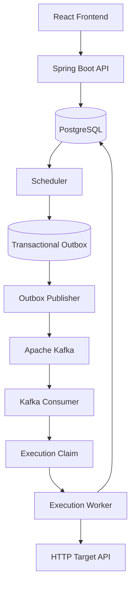

# Distributed Job Scheduler

A distributed job scheduling system built with **Spring Boot, PostgreSQL, Apache Kafka, and React**. The platform allows users to schedule HTTP jobs, execute them asynchronously, track execution history, and handle failures through configurable retries.

The project focuses on backend engineering concepts including durable scheduling, concurrent execution claiming, asynchronous processing, transactional outbox, retry policies, and failure recovery.

## Architecture



**Design principle:** PostgreSQL is the source of truth for jobs and executions. The scheduler determines when an execution should occur, while Kafka enables asynchronous delivery to workers.

## Features

### Job Management

* Create, view, pause, resume, and soft-delete jobs.
* Support for one-time, interval-based, and cron schedules.
* Configure the target HTTP endpoint, request details, and execution timeout.
* Track job status and execution history through the dashboard.

### Scheduling Engine

* In-memory priority queue ordered by each job's next scheduled execution time.
* Condition-based thread waiting instead of continuously polling PostgreSQL.
* Wake-up signaling when a job is added to the queue.
* Reload active jobs from PostgreSQL when the application starts.
* Persist `next_run_at` so scheduling state survives application restarts.
* Calculate the next future occurrence after processing a scheduled job.

### Asynchronous Execution

* Publish execution requests to Apache Kafka.
* Process jobs asynchronously through Kafka consumers.
* Separate scheduling decisions from HTTP execution.
* Track executions and their individual attempts in PostgreSQL.

### Transactional Outbox

* Persist execution requests and outbox events within the same database transaction.
* Publish pending events to Kafka asynchronously.
* Mark events as published only after Kafka acknowledges the message.
* Retain unpublished events when publishing fails, allowing subsequent retries.
* Expire overdue pending events and mark their executions as missed.

### Retry Handling

* Configurable maximum retries, initial retry delay, and maximum retry delay.
* Exponential backoff with a maximum delay.
* Retry server-side HTTP failures (5xx) and transient network failures.
* Treat client-side HTTP failures (4xx) as non-retryable.
* Record individual attempts and their outcomes.

### Execution Tracking

* Separate execution records from individual attempts.
* Track execution status, scheduled time, start time, completion time, and failure reason.
* Prevent concurrent workers from claiming the same pending execution using a conditional database update.
* Handle duplicate Kafka messages through execution claiming.

### Frontend

* React dashboard for managing jobs.
* Create-job form and job details.
* Execution history and execution details.
* Pause, resume, and delete actions.

## Technology Stack

| Component           | Technology                                |
| ------------------- | ----------------------------------------- |
| Backend             | Java 25, Spring Boot                      |
| Database            | PostgreSQL                                |
| Database migrations | Flyway                                    |
| Messaging           | Apache Kafka                              |
| Frontend            | React, Vite, JavaScript, CSS              |
| Testing             | JUnit 5, Mockito, Testcontainers          |
| API documentation   | OpenAPI / Swagger                         |
| Monitoring          | Spring Boot Actuator, Prometheus, Grafana |
| Build tool          | Maven                                     |
| Containerization    | Docker                                    |

## Scheduling Semantics

The scheduler supports three schedule types:

| Type       | Description                            | Example               |
| ---------- | -------------------------------------- | --------------------- |
| `ONE_TIME` | Execute once at a specified time       | `2026-10-01T10:00:00` |
| `INTERVAL` | Execute repeatedly at a fixed interval | `PT5M`                |
| `CRON`     | Execute according to a cron expression | `0 0 10 * * *`        |

Cron expressions use Spring's six-field format, including seconds.

### Job Lifecycle

Jobs have the following states:

* `ACTIVE` — eligible for scheduling.
* `PAUSED` — future scheduling is paused.
* `DELETED` — soft-deleted and excluded from normal operation.

Pausing a job affects future scheduling; it does not cancel an execution already in progress. Resuming a job does not trigger automatic catch-up for occurrences missed while paused.

### Execution Lifecycle

```text
PENDING
   |
   v
 RUNNING
   |
   +------> SUCCESS
   |
   +------> FAILED

PENDING ------> MISSED
PENDING ------> SKIPPED
```

* `PENDING` — execution has been created but not claimed.
* `RUNNING` — a worker has claimed the execution.
* `SUCCESS` — execution completed successfully.
* `FAILED` — execution failed after applying the retry policy.
* `MISSED` — the occurrence was not dispatched within the allowed scheduling/delivery window.
* `SKIPPED` — an occurrence was intentionally not executed.

Each scheduled occurrence creates one execution. Retries are represented as attempts belonging to that execution, rather than separate executions.

## Retry Policy

The retry policy distinguishes between permanent and transient failures.

| Outcome                    | Behavior                              |
| -------------------------- | ------------------------------------- |
| HTTP 2xx                   | Mark attempt and execution successful |
| HTTP 4xx                   | Fail without retrying                 |
| HTTP 5xx                   | Retry, subject to retry limit         |
| Network or timeout failure | Retry, subject to retry limit         |
| Retries exhausted          | Mark execution as `FAILED`            |

The exponential backoff delay is calculated as:

$$
\text{delay}=\min(\text{initialDelay}\times 2^{(\text{attempt}-1)},\text{maxDelay})
$$

The configured maximum retry count represents retries **after the initial attempt**. For example, `maxRetries = 3` permits up to four total attempts.

## Reliability and Failure Handling

### Durable Scheduling

Job schedules and their next execution times are stored in PostgreSQL. The in-memory priority queue is reconstructed from persisted active jobs when the scheduler starts.

### Concurrent Execution Claims

Workers claim executions through a conditional database update. Only a worker that successfully transitions an execution from `PENDING` to `RUNNING` is allowed to process it.

### At-Least-Once Message Delivery

The transactional outbox prevents execution requests from being lost between committing database changes and publishing to Kafka.

Outbox publishing is **at-least-once**, not exactly-once. For example, if the application crashes after Kafka acknowledges a message but before the database records it as published, the event may be published again. Execution claiming protects against duplicate processing of an already-claimed execution.

### Missed Executions

The scheduler identifies overdue occurrences during startup recovery and records them as missed rather than automatically replaying every missed occurrence. The next future schedule is calculated and persisted.

## Database Design

The main entities are:

* **Users** — application users.
* **Jobs** — job configuration, schedule, status, and next execution time.
* **Executions** — one record per scheduled occurrence.
* **Attempts** — individual execution attempts, including retries.
* **Outbox Events** — durable events awaiting publication to Kafka.

PostgreSQL stores timestamps with time-zone awareness. Flyway manages schema changes through versioned migrations.

## Testing

The project includes unit tests, database integration tests, and concurrency-focused tests.

Test coverage includes:

* Concurrent execution claims against PostgreSQL using Testcontainers.
* Duplicate Kafka message handling at the consumer logic level.
* Outbox behavior when Kafka publishing fails.
* Missed and normal scheduled execution paths.
* The scheduler-startup time boundary.
* Priority queue ordering and job removal.
* Waking a waiting scheduler thread when an earlier job is added.

**Latest test run: 26 tests passed.**

Run the complete test suite:

```bash
mvn test
```

Run an individual test class:

```bash
mvn -Dtest=ScheduledJobProcessorTest test
```

## Getting Started

### Prerequisites

* Java 25
* Maven
* PostgreSQL
* Apache Kafka
* Node.js and npm
* Docker, for running containerized dependencies and Testcontainers tests

### 1. Clone the repository

```bash
git clone https://github.com/shivamkachawar/job-scheduler.git
cd job-scheduler
```

### 2. Configure the backend

Configure the PostgreSQL connection and Kafka bootstrap servers using the application's configuration.

Keep credentials and environment-specific settings outside source control. Use environment variables or a local, untracked configuration file for secrets.

### 3. Run database migrations

Flyway migrations are configured in the Spring Boot application and run during application startup.

### 4. Start the backend

```bash
mvn spring-boot:run
```

### 5. Start the frontend

From the frontend directory:

```bash
npm install
npm run dev
```

Configure the frontend's API base URL to point to the running Spring Boot backend.

> PostgreSQL and Kafka must be running and reachable before using the application. Refer to the application configuration for the exact ports and connection settings.

## Future Improvements

* Coordinate multiple scheduler instances to prevent duplicate scheduling.
* Add atomic outbox-event claiming for multiple publisher instances.
* Strengthen crash-recovery and end-to-end Kafka redelivery testing.
* Externalize scheduling and delivery deadline configuration.
* Add distributed coordination and locking where required.
* Expand observability with execution latency, queue depth, retry, and failure metrics.
* Improve operational controls and deployment documentation.

## What I Learned

Building this project provided hands-on experience with:

* Designing durable scheduling systems.
* Implementing producer-consumer workflows with Kafka.
* Applying the transactional outbox pattern.
* Handling duplicate messages and concurrent database updates.
* Designing retry policies with exponential backoff.
* Testing concurrency and persistence behavior with PostgreSQL and Testcontainers.
* Separating scheduling, message delivery, and execution responsibilities.

---

**Author:** Shivam Kachawar

**GitHub:** [shivamkachawar](https://github.com/shivamkachawar)
